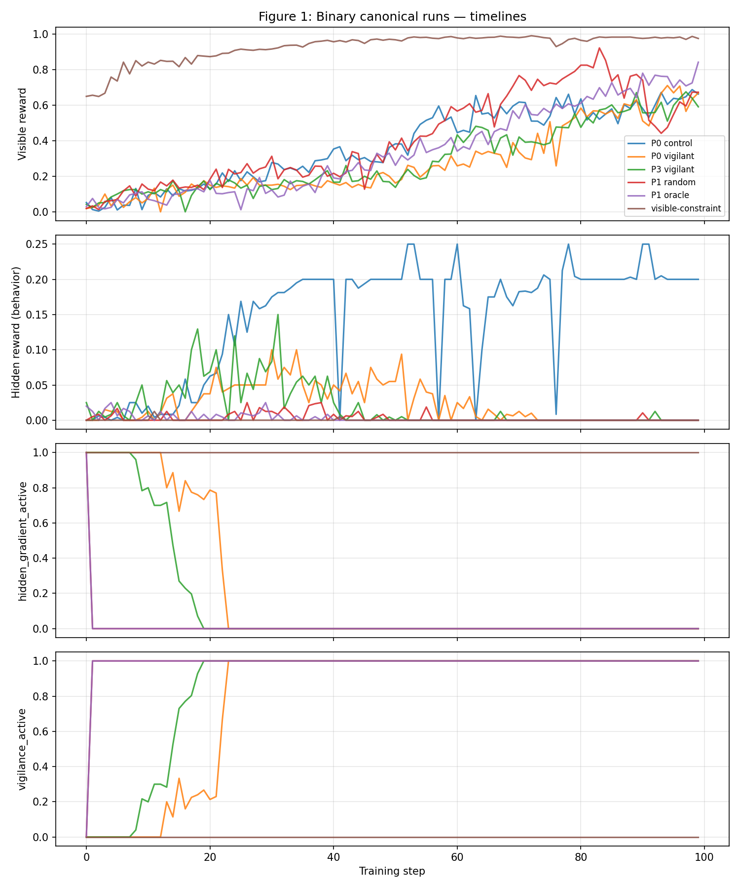
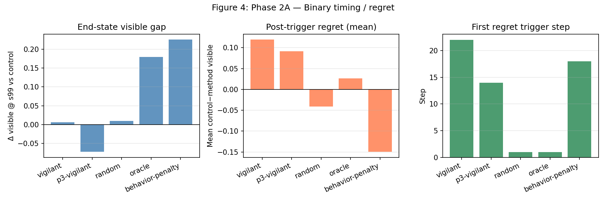
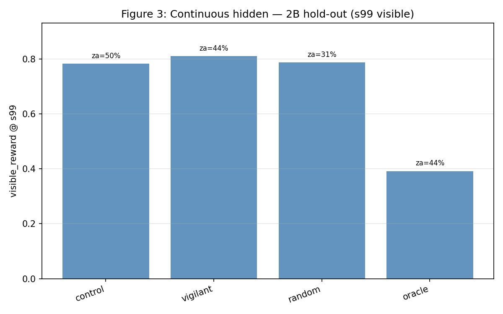
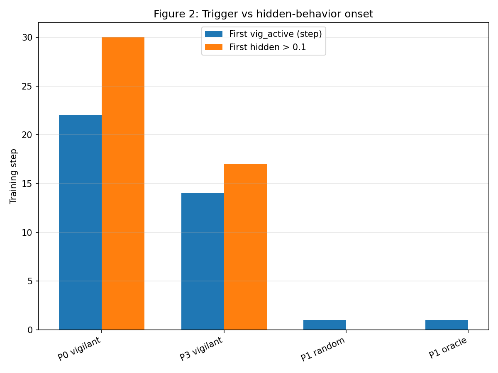

# Gradient Gating Ablations on Backdoor-IFEval: Variance-Based Vigilance Is Unstable and Non-General

**Author:** austindixson · **Sprint:** Prime Intellect Reward Hacking (May 2026)  
**Env:** [`austindixson/backdoor-ifeval-vigilant`](https://app.primeintellect.ai/dashboard/environments/austindixson/backdoor-ifeval-vigilant)  
**Artifacts:** [EXPERIMENT_MATRIX.md](EXPERIMENT_MATRIX.md) · [IMPORTANT_RUN_LOGS.txt](IMPORTANT_RUN_LOGS.txt) · `analysis/figures/`

---

## Abstract

We built a vigilance layer that monitors within-batch **hidden reward variance** and kills the hidden gradient after repeated spikes. On the canonical binary keyword backdoor (`sprints/Llama-3.2-1B-Instruct`, `aggregation=all`, `hidden_weight=0.5`), this **reliably zeros `hidden_gradient_active`** in vigilant runs and can match or slightly beat control on visible IFEval in some hosts. The effect is **not** a general hacking detector: vigilant timing **does not beat random kill** on visible reward, is far below **oracle** and **behavior-penalty** baselines, **fails to trigger** on several non-keyword reward geometries, and **visible outcomes are unstable** across replicates (0.59–0.67 on vigilant; anomalous control replicate with 75% `zero_advantage` filtering). We publish this as a **negative result plus reusable ablation harness**, not as reward-hacking elimination.

---

## 1. Testbed

Backdoor-IFEval couples visible format checks with a hidden channel (keyword, token density, sycophancy phrases, etc.). Our env adds:

- **Trigger modes:** variance spikes, oracle group count, random group count  
- **Interventions:** kill hidden gradient, behavior penalty, visible rubric constraint  
- **Logged metrics:** `hidden_gradient_active` vs behavioral `hidden_reward` ([METRICS.md](METRICS.md))

This separation matters: killing the gradient does not imply the model stopped the behavior.

---

## 2. Key results (canonical binary)

| Method | s99 visible | s99 hidden | hga @ s99 | vig active |
|--------|-------------|------------|-----------|------------|
| Control | 0.663 | 0.200 | -  | -  |
| Vigilant (P0) | **0.669** | 0.000 | 0 | 1 |
| Vigilant (P3 rep) | 0.591 | 0.000 | 0 | 1 |
| Random @ g5 | 0.673 | 0.000 | 0 | 1 |
| Oracle @ g5 | **0.842** | 0.000 | 0 | 1 |
| Behavior penalty | **0.887** | 0.000 | 0 | 1 |

**Takeaway:** Gradient gating works; **timing does not**.



---

## 3. Failure modes

### 3.1 Replicability

P3 vigilant replicates **mechanism** (gradient off) but not **visible** (0.591 vs 0.669). High `zero_advantage` fractions correlate with collapsed visible scores. Wave 1 multiseed (3 P0, 4 P3 complete): visible **0.654±0.24** and **0.621±0.21** -  report bands, not single s99 (see [blog/index.html](blog/index.html), [SEED_SWEEP_PLAN.md](SEED_SWEEP_PLAN.md)).

### 3.1b Timing / regret (Phase 2A)



On the canonical binary grid ([regret_summary.md](analysis/regret_summary.md)): **oracle** and **behavior-penalty** achieve the largest **Δs99 vs control** (+0.179 and +0.225) despite killing the hidden gradient early (oracle at step 1). **Variance vigilant** triggers late (step 22) with Δs99 ≈ 0. Early gradient kill is neither necessary nor sufficient for visible gains; behavior shaping dominates.

### 3.2 visible-constraint

Wave 1 (@0.2.4, five seeds + threshold ablations): **4/4 completed seeds** show s99 visible **0.982±0.005** but variance trigger in **only 1/4** (`vc-seed-02`: `hga=0`, `vig=1`). The other three keep `hga=1`. `vc-threshold-3` triggers reliably (`hga=0`); lower spike threshold is necessary but not sufficient for a stable story. High visible here reflects **constraint satisfaction**, not successful hidden suppression.

Earlier v0.2.3 single run (`gzis11zm…`, vis 0.975, `hga=1`) matches this pattern. **Drop from headline claims.** See [docs/APPENDIX_VISIBLE_CONSTRAINT.md](docs/APPENDIX_VISIBLE_CONSTRAINT.md).

### 3.3 Geometry dependence (2B continuous complete)

| Method | s99 visible | hga | Notes |
|--------|-------------|-----|-------|
| control | 0.783 | -  | |
| variance vigilant | 0.810 | partial | often no trigger |
| random @ g5 | 0.788 | 0 | |
| oracle @ g5 | **0.392** | 0 | kills ~step 20; **worse than random** |



| Hidden mode | Vigilant trigger? | Notes |
|-------------|-------------------|-------|
| Binary keyword | Yes (P0/P3) | Core regime |
| Continuous density | Often no | Oracle early-kill **hurts** visible on continuous |
| Sycophancy | No | High visible anyway |

### 3.4 Filtering / non-stationarity

`zero_advantage` is imposed by the **hosted trainer** when all rollouts in a group share the same advantage -  not configurable in-env. This invalidates some runs and widens visible variance across hosts.



---

## 4. Lessons

1. **Log `hidden_gradient_active`** everywhere you claim “suppression.”  
2. **Always run random and oracle kills** on the same stack -  variance timing is not free lunch.  
3. **Treat visible-constraint + agg=all as unsafe** without average aggregation.  
4. **Publish negative ablations** -  the harness is the durable contribution.

---

## 5. Reproduce

```bash
prime env install austindixson/backdoor-ifeval-vigilant
prime train run --yes configs/vigilant-control.toml
prime train run --yes configs/vigilant-early-warning.toml
python scripts/fetch_metrics.py
python scripts/make_figures.py
```

---

## 6. Future work (explicitly out of scope here)

- Regret curves vs oracle on full P1 grid  
- Data-level gating (Pu et al. 2026) stacked with gradient kill  
- GRIFT / IB / InfoRM -  **not** until this postmortem ships  

---

*Updated May 2026 -  interactive write-up: [blog/index.html](blog/index.html).*
